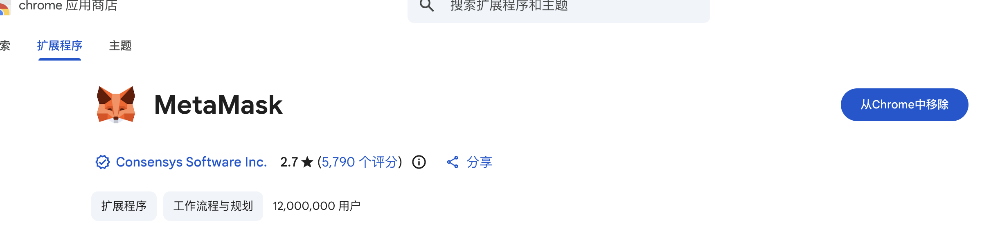
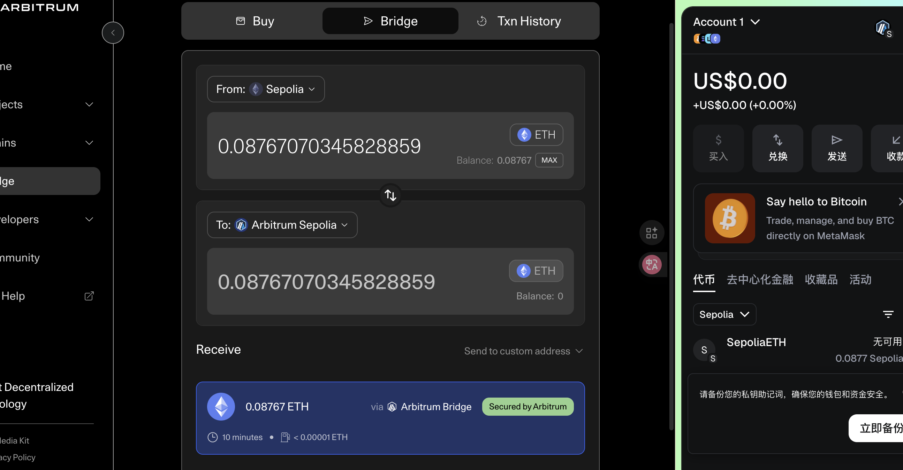
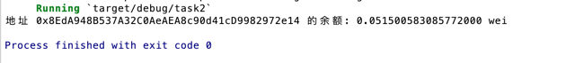
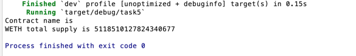

## 作业

### task1

钱包安装: 

将领取的eth测试币跨链到arb 

task1 代码 [task1](src/bin/task1.rs)

### task2

运行截图: 

task2 代码 [task2](src/bin/task2.rs)

### task3

task3 代码 [task3](src/bin/task3.rs)

### task4

task4 代码 [task4](src/bin/task4.rs)

运行日志 [日志](logs/转账.log)

转账tx:[tx](https://sepolia.arbiscan.io/tx/0x83ce6e0a2c79aa28b650dd7c901e0c15e75bf2933ad4b524a19a4fd98846c6e3)

### task5

task5 代码 [task5](src/bin/task5.rs)

运行截图: 

